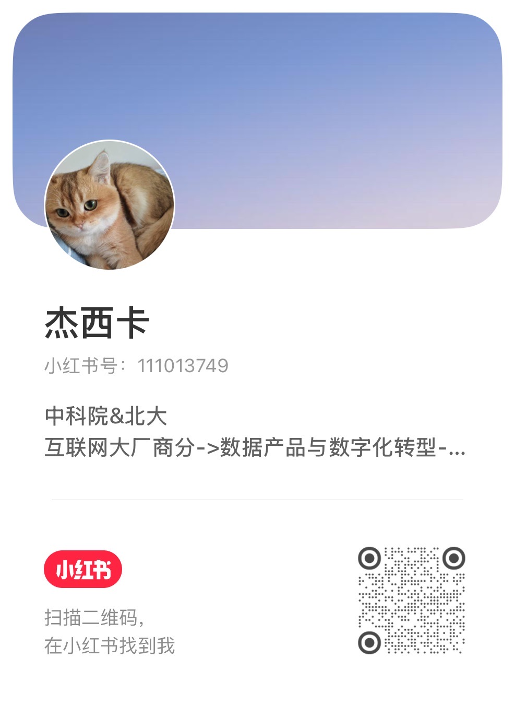

# Knowledge Workbench · 知识工作台

> 一个人做内容、为自己边做边搭的工作台，在这里公开记录它长大的过程。**欢迎 ⭐ star 关注、来交流想法。**
> Reads what you read + your own hard-won experience → collide into judgment → write it → ship it → learn from the results.

> 当前状态：产品主流程已可用，正在完成飞书 AI 黑客松的首次正式公网部署。现有功能与比赛期间更新见 [CHANGELOG](./CHANGELOG.md)。

## 一条完整内容流程

```text
发现信息 → 解读与筛选 → 沉淀素材 → 形成主题与判断
         → 创作母稿 → 多平台适配与发布 → 数据回流与复盘
```

- **发现与解读**：从稳定信源里筛出少量必读，读懂网页、文档、视频和播客。
- **素材与主题**：把外部信息和自己的坑、经验、判断放在一起，长成持续更新的主题综述。
- **母稿创作**：用真实素材起稿，保留溯源，在飞书里评审定稿。
- **适配与发布**：将同一核心判断重组为公众号、小红书、抖音等平台的原生形态，最后发布由人确认。
- **数据复盘**：自动回收已发布内容的表现，横向对比后反馈下一次选题。

新手导航候选方案见 [`prototype/mock-pages/content-flow-overview.html`](./prototype/mock-pages/content-flow-overview.html)。

## 使用方式

- **日常使用**：运行桌面 `KW-知识工作台.command`，优先走 `localhost:3000` SSH 隧道，失败时退回 Tailscale。
- **前端开发**：`cd frontend && npm install && npm run dev`，打开 `http://localhost:5173`。
- **后端开发**：参考 `backend/.env.example` 配置后，`cd backend && npm install && npm run dev`。Mac 本地 SQLite 是旧快照，不在 Mac 跑真实 ingest。
- **生产部署**：见 [DEPLOYMENT.md](./DEPLOYMENT.md)，包含访问保护、健康检查、SQLite 备份、验收和回滚。

**English** · [中文](#中文)

https://github.com/user-attachments/assets/2d873ad5-4439-4a17-9f24-9112ee7d2ce0

<div align="center"><sub>▶️ 3 分钟正片《一个人，用 AI 做内容》· a 3-min walkthrough of the workbench</sub></div>

## English

**Saved hundreds of articles, yet when it's time to write you can't recall a single one?** And here's the thing — what's truly valuable usually isn't those bookmarks; it's **the pitfalls you hit doing the work, the judgments hashed out in meetings, the sparks that flash through your mind** — and those are the ones most easily lost.

Read-later apps help you *stash* articles, notes help you *jot down* ideas, AI helps you *make sense* of material — **and then what?** What you've stashed, jotted, and understood rarely turns into something you actually ship.

**This workbench aims to fill two gaps:**

1. Put **what you read** (high-quality external information) and **what you've accumulated yourself** (sparks, project experience and pitfalls — flowing in casually from Feishu Bitable / docs / knowledge base / group chats / meeting notes / DMs) together to **collide**, growing into content **no one else can write, only you can**.
2. Make that content actually **get written and shipped**, then feed the review back into the next round — turning it into a **content flywheel**.

The approach is simple: **AI eats every chore that produces no understanding** — collecting, translating, summarizing, clustering, formatting, platform adaptation; **judgment, opinion, and expression are left to the human.**

> **What you read ＋ your own first-hand experience → collide into judgment → write it → ship it → feed the review back → understand better what to write next**

> **The flywheel's first full loop is now built**: "publish → data → review → self-evolution" — automatically pulling shipped content's performance back for side-by-side comparison — now works across all four platforms (Xiaohongshu / WeChat / Douyin / Video Account). Next up is sharpening the attribution and self-evolution.

---

## 🧭 One through-line: the North Star

Every decision this workbench makes first passes through one gate — not "will this grow traffic," but "**does this piece actually leave the reader better off**."

- **max(resonance density) ≠ max(traffic)**: better to be seen by the right people and connect with those on the same wavelength than to chase a single viral hit.
- **The human-machine dividing line**: opinion, taste, judgment, authenticity — left to the human; collecting, translating, summarizing, formatting, platform adaptation — handed to AI.
- **No piling on viral hooks**: rather than chasing clickbait (every platform's algorithm is also downranking "clickbait with no real value"), better to honestly make the value clear.

---

## 🎯 What problem it solves

Others' information you can get too, but **the pitfalls you hit doing the work, your experience and judgment — only you have those**. Truly valuable content others can't copy comes from **your first-hand experience × the collision with external information** — not the information itself.

This workbench turns "two streams of first-hand material → cognition → content" into one spinning line:

```
 External info (what you read · multi-source)   ＋   Your first-hand experience (sparks / pitfalls / wins & losses · casually in via Feishu etc.)
                       ↓ Collect + filter (AI fully-automatic denoising, keep only high signal-to-noise)
                 Topic ammunition depot (narrow: two streams collide, filed under long-term research topics)
                       ↓ Explore (the human's home turf: dialogue with AI around questions, distilling judgment)
                   Deep draft (value crystallization point · only you can write it)
                       ↓ Fission (AI fully-automatic: long-form / thread / voiceover / image-text…)
                   Multi-platform content (widen)
                       ↓ Publish + review (data flows back automatically, side-by-side comparison)
                   Feed back to next round (closed loop · first full version working)
```

Division-of-labor principle: **AI eats every link that produces no understanding**; **"deciding what to write, the core thesis, the judgment" stays in the human's hands**.

---

## ✨ What it does

### 📥 Feed — not an information stream, an intelligence desk
No longer "dumping every source on you," but helping you filter down to **a small high-signal-to-noise handful**:
- After multi-source collection (AI curated boards / Hacker News / GitHub Trending + the X / blogs / newsletters / podcasts / YouTube you register), AI denoises first — **keeping only what's AI-related, fresh enough, and deduplicated**.
- **Curation first**: open it and first see today's must-read handful, each marked with "why it made the cut," so you see through it at a glance and adjust on the fly (who's in and who's out is your call, not a black box guessing your taste).
- **Topic cards**: multiple sources reporting the same thing are auto-merged into one card + an AI synthesized summary; click in to see which sources.
- A daily brief + weekly / monthly reports to watch trends and topic evolution.

### 📝 Material — accumulation (external + your own first-hand)
- One-click save anything useful you read as material; **your own first-hand is collected too** — ideas, experience, and pitfalls from Feishu Bitable / docs / knowledge base / group chats / meeting notes / DMs flow in casually, and AI auto-titles them and files them under the relevant topic.
- Semantic search: recall material you've saved in plain language, and query the whole material library with AI as a search engine.

### 📚 Topics — knowledge processing (core asset)
- Each topic is a review that AI helps you continuously maintain: save in new material (external info or your experience) and it auto-updates the cognition, flags conflicting opinions, and logs every edit.
- Explore this topic with AI anytime (using your own review and material as ammunition) — **external information and your experience collide into judgment right here**.

### 💡 Sparks — topic seeds
- A topic-seed inbox: whatever you scroll past that's writable, the pitfall that surfaces while working, what comes out of a meeting, whatever you jot down — take it in first, don't forget it once you're done.
- Drop in a link / meeting notes / audio / PDF / Feishu doc, and AI helps you understand it, saves it as material, and can promote it to a spark; **English videos on X / YouTube work too** — auto-download and transcribe (pull subtitles directly if present, cloud/local speech recognition if not), translate into Chinese, then interpret.
- **Understand wherever you scroll** (three entry points): the Mac browser extension gives a one-click "interpret" next to a tweet (follow-up questions allowed, save with your thoughts as a spark); in X's Mac App, copy the link and click "read it" to go straight there; on your phone, send the link to the Feishu bot and the Chinese interpretation comes straight back — reply with one thought and it's set as a spark, auto-synced into Feishu Bitable.
- Writing board: helps you see clearly which piece is "ready — enough material, can write," so you decide which to write first.

### ✍️ Create — from a few pieces of material to a ship-ready finished piece
Three steps: **pick a few pieces of material → AI drafts a deep piece → one click turns it into things each platform can directly publish.**
- **AI writes your material into a draft**: check a few pieces from the material library (or pull from Feishu, or paste a passage on the fly), and AI drafts a deep version in the style you choose; if you're not happy, tell it right there to "remove the AI flavor," "pick holes," "give me three ways to rewrite this passage, I'll pick one."
- **The master draft lands in Feishu for review**: the drafted master doc is auto-created in your Feishu personal knowledge base "Content Workshop," where you comment, @ the bot to revise, and finalize in Feishu — review moves to where you already work, while the master draft stays clean markdown.
- **One draft, one click into the shape each platform should have** (not the same piece copy-pasted everywhere):
  - **WeChat** — auto-formatted, cover image made along with it, export and ship;
  - **Xiaohongshu / Douyin image-text** — auto-generate card images one by one, swap styles, click to edit text, download directly;
  - **Douyin / Bilibili voiceover** — auto-cut into shots, add audio, output a vertical video;
  - plus X thread, Jike… each grown into that platform's native shape.
- **Multiple visual styles, swap freely** (Warm Journal / Midnight Neon / Aesop / Neo-Brutalist…): pick a "series style" and header image, layout, and voiceover are unified.
- **Not the "obviously AI-written" cookie-cutter kind**: whether it reads like AI isn't something de-AI-ed out afterward — it's **whether real human corpus was fed in from the start** — so every template connects to a real deconstructed corpus (e.g. Douyin voiceover learns "grind on the mechanism, anti-viral," not the 3-second-hook playbook); and each passage can be clicked back to see which piece of material it cites.

### 📊 Review — let what's shipped feed the next round
Automatically pull back the performance data of already-published content **for side-by-side comparison** (the difference of the same piece across Xiaohongshu / WeChat / Douyin / Video Account), helping me see clearly "which way of writing actually leaves readers better off," then feed it back into the next topic choice. **Automatic data flow-back now works across all four platforms (Xiaohongshu / WeChat / Douyin / Video Account)** — the last link of the flywheel is closed, and its first full loop is built.

---

## 🗺 What's being built · What's next

**The flywheel's first full loop — "publish → data → review → self-evolution" — is now built**: automatic data flow-back and side-by-side comparison now work across all four platforms (Xiaohongshu / WeChat / Douyin / Video Account), and the next step is to let the system help me see clearly "which way of writing actually leaves readers better off," then feed it back into the next topic choice.

Want to watch it grow or talk ideas — ⭐ star and follow, or open an issue.

---

## 📄 About this repo · Usage & Rights

This is my **personal work and a product-in-progress · build in public** — going public to document an attempt to turn "two streams of first-hand material (what you read + what you've accumulated) → cognition → content" into a flywheel, for viewing, learning, exchange, and inspiration, and also as part of my portfolio. It's not finished yet.

- ✅ **Welcome**: reading, learning, ⭐ Star, opening Issues to exchange; quoting and discussing **provided you cite the source and link back to this repo / my homepage**.
- 🚫 **Not yet licensed**: without written permission, please do not use for commercial purposes, redistribute, or develop derivative products based on this project's source code.
- 🙏 If it inspired you, **cite the source and @ me** (WeChat / Xiaohongshu "杰西卡聊AI") — that's the best support.

Copyright © 2026 Jessica · All rights not expressly granted are reserved.

> Not another read-later / notes / RSS reader — those stop at "stash and read"; this workbench **treats your own experience and pitfalls as material too**, colliding them with external information, filling in that half-step of "turning it into something you actually ship."

---

<a name="中文"></a>

## 中文

**收藏了几百篇，真到动笔却一篇都想不起来？** 而且——真正值钱的往往不是那些收藏，是你**自己做事踩的坑、开会聊出的判断、脑子里一闪而过的灵感**，这些更容易丢。

稍后读帮你把文章*存起来*，笔记帮你把想法*记下来*，AI 帮你把资料*读明白*——**然后呢？** 存下的、记下的、读懂的，最后极少变成你真正发出去的东西。

**这个工作台想补两件事：**

1. 把**你读到的**（外部高质量信息）和**你自己攒下的**（灵感、做项目的经验与踩坑——从飞书多维表格 / 文档 / 知识库 / 群聊 / 会议纪要 / 私聊随手进来）放在一起**碰撞**，长出**别人写不出、只有你能写**的内容。
2. 让这些内容真的**写出来、发出去**，再复盘反哺下一次——转成一条**内容飞轮**。

做法很简单：**AI 吃掉一切不产生理解的杂活**——采集、翻译、摘要、聚类、排版、平台适配；**判断、观点、表达，留给人。**

> **读到的 ＋ 自己的一手经验 → 碰撞想明白 → 写出来 → 发出去 → 复盘反哺 → 更懂下一篇写什么**

> **飞轮第一版完整闭环已建成**：「发布 → 数据 → 复盘」——把发出去的内容表现自动接回来做横向对照——**四平台（小红书 / 公众号 / 抖音 / 视频号）已全部打通**。接下来是持续打磨归因与自进化，让它更准地反哺下一次选题。

---

## 🧭 一条主线：北极星

这个工作台每做一个决定，都先过一道关卡——不是"这样能不能涨流量"，而是"**这条内容有没有真的让读者更有收获**"。

- **max(同频密度) ≠ max(流量)**：宁可被对的人看到、连接上同频的人，也不追一篇的爆。
- **人机分界线**：观点、品味、判断、真实性——留给人；采集、翻译、摘要、排版、平台适配——交给 AI。
- **不堆爆款钩子**：与其追标题党（各平台算法也都在给"标题党无真价值"降权），不如老实把价值讲清楚。

---

## 🎯 它解决什么问题

别人的信息你也能拿到，但**你做事踩的坑、你的经验和判断，只有你有**。真正有价值、别人复制不了的内容，来自**你的一手经验 × 外部信息的碰撞**——不是信息本身。

这个工作台把「两股一手料 → 认知 → 内容」做成一条转起来的线：

```
 外部信息（读到的 · 多源）   ＋   你的一手经验（灵感 / 踩坑 / 得失 · 飞书等随手进）
                       ↓ 采集 + 筛选（AI 全自动降噪，只留高信噪比）
                 主题弹药库（收窄：两股料碰撞，归入长期研究的主题）
                       ↓ 探讨（人的主场：带着问题与 AI 对话，沉淀判断）
                   深稿（价值凝结点 · 只有你能写的）
                       ↓ 裂变（AI 全自动：长文 / thread / 口播 / 图文…）
                   多平台内容（放宽）
                       ↓ 发布 + 复盘（数据自动回流，横向对照）
                   反哺下一次（闭环 · 第一版已打通）
```

分工原则：**AI 吃掉一切不产生理解的环节**；**「决定写什么、核心论点、判断」留在人手上**。

---

## ✨ 有什么功能

### 📥 资讯 —— 不是信息流，是情报台
不再"把源全倒给你"，而是帮你筛成**高信噪比的一小撮**：
- 多源采集（AI 精选榜 / Hacker News / GitHub Trending + 你登记的 X / 博客 / newsletter / 播客 / YouTube）后，AI 先降噪——**只留 AI 相关、够新、去过重的**。
- **精选优先**：打开先看今日该看的一小撮，每条标「为什么入选」，你一眼看穿、随手调（要谁不要谁你说了算，不是猜你口味的黑盒）。
- **话题卡**：同一件事多源报道自动合并成一张卡 + AI 综合总结，点开看是哪几个源。
- 每天一份简报 + 周报 / 月报看趋势与主题演进。

### 📝 素材 —— 沉淀（外部 + 你自己的一手）
- 读到有用的一键存为素材；**你自己的一手也一起收**——飞书多维表格 / 文档 / 知识库 / 群聊 / 会议纪要 / 私聊里的想法、经验、踩坑，随手进来，AI 自动起标题、归入相关主题。
- 语义搜索：用大白话就能找回攒过的料，也能把 AI 当搜索引擎问整个素材库。

### 📚 主题 —— 知识加工（核心资产）
- 每个主题是一篇 AI 帮你持续维护的综述：存进新素材（外部信息或你的经验），它自动更新认知、标出观点冲突、记下每次修改。
- 随时和 AI 探讨这个主题（拿你自己的综述和素材当弹药）——**外部信息和你的经验，就在这里碰撞成判断**。

### 💡 灵感 —— 选题种子
- 选题种子收集箱：刷到能写的、做事踩坑冒出的、开会聊出的、随手记的，先收下来，别忙完就忘。
- 丢链接 / 会议纪要 / 音频 / PDF / 飞书文档进来，AI 帮你读懂、存成素材、可提为灵感；**X / YouTube 的英文视频也行**——自动下载转写（有字幕直取、无字幕云端/本地语音识别）、翻成中文再解读。
- **哪里刷到哪里懂**（三端入口）：Mac 浏览器插件在推文旁一键「解读」（可追问、带感想存灵感）；X 的 Mac App 里拷贝链接点「读懂」直达；手机把链接发给飞书机器人，中文解读直接回你，回一句感想即立为灵感、自动同步进飞书多维表格。
- 写作看板：帮你看清哪条「料够了、可以写」，决定先写哪一条。

### ✍️ 创作 —— 从几条素材，到能直接发出去的成品
三步：**挑几条素材 → AI 起一篇深稿 → 一键变成各平台能直接发的东西。**
- **AI 帮你把素材写成一篇稿**：从素材库勾几条（也能从飞书拉、随手粘一段），AI 按你选的文体起一版深稿；写得不满意，就地让它「去掉 AI 味」「挑毛病」「这段给我三个改法挑一个」。
- **母稿落飞书评审**：起草出的母稿自动建到你的飞书个人知识库「内容工场」，在飞书里评论、@机器人改稿、定稿——评审搬到你已经在用的地方，母稿保持干净 markdown。
- **一篇稿，一键变成每个平台该有的样子**（不是同一篇到处复制粘贴）：
  - **公众号**——自动排好版、连封面图一起做好，导出就能发；
  - **小红书 / 抖音图文**——自动生成一张张卡片图，能换风格、点着改字、直接下载；
  - **抖音 / B站口播**——自动切好分镜、配上音，出竖版视频；
  - 还有 X thread、即刻…每个都长成该平台原生的样子。
- **多种视觉风格随便换**（暖刊 / 午夜霓虹 / Aesop / 新粗野…），选一套「系列风格」就统一了头图、排版和配音。
- **不是"一看就是 AI 写的"套路货**：像不像 AI，不是事后去 AI 味改出来的，是**一开始有没有接真人语料**写出来的——所以每个模板都接一份真实拆解语料（比如抖音口播学"死磕机制、反爆款"，不是 3 秒钩子那套）；每段还能点回去看它引自哪条素材。

### 📊 复盘 —— 让发出去的反哺下一次
把已发内容的表现数据**自动拉回来做横向对照**（同一条内容在小红书 / 公众号 / 抖音 / 视频号的差异），帮我看清"哪种写法真的让读者更有收获"，再反哺下一次选题。**四平台（小红书 / 公众号 / 抖音 / 视频号）数据自动回流已全部打通**——飞轮的最后一环闭上了，第一版完整闭环就此建成。

---

## 🗺 在做什么 · 接下来

**飞轮的第一版完整闭环已经建成**：四平台（小红书 / 公众号 / 抖音 / 视频号）已发数据自动回流、横向对照全部打通，「发布 → 数据 → 复盘」这最后半环闭上了。下一步是持续打磨归因——让系统更准地看清「哪种写法真的让读者更有收获」，再反哺下一次选题（自进化方向）。

想看它长大、聊聊想法，欢迎 ⭐ star 关注或开 issue 交流。

---

## 📄 关于这个仓库 · 使用声明

这是我的**个人作品与在建产品 · build in public**——公开是为了记录一个把「两股一手料（读到的 + 自己攒的）→ 认知 → 内容」做成飞轮的尝试，供查看、学习、交流与获得启发，也是我作品集的一部分。它还没做完。

- ✅ **欢迎**：阅读、学习、⭐ Star、开 Issue 交流；在**注明出处并链接回本仓 / 我的主页**的前提下引用与讨论。
- 🚫 **暂不授权**：未经书面许可，请勿用于商业用途、二次分发，或基于本项目源码开发衍生产品。
- 🙏 如果它启发了你，**注明出处并 @ 我**（公众号 / 小红书「杰西卡聊AI」）就是最好的支持。

版权所有 © 2026 杰西卡 · 保留未明确授予的一切权利（All rights reserved）。

> 不是又一个稍后读 / 笔记 / RSS 阅读器——它们止步于「存和读」；这个工作台把**你自己的经验和踩坑也当素材**，和外部信息碰撞，补上「变成你真正发出去的东西」那半步。

---

## 🔗 关注我 · Follow me

边做 AI 产品边把一手经验和思考公开分享，欢迎关注、来聊。<br>
I build AI products in public and share the notes here — come say hi:

<table>
  <tr>
    <td align="center"><b>小红书 · Xiaohongshu</b></td>
    <td align="center"><b>公众号 · WeChat</b></td>
    <td align="center"><b>视频号 · Channels</b></td>
    <td align="center"><b>抖音 · Douyin</b></td>
  </tr>
  <tr>
    <td align="center"></td>
    <td align="center"></td>
    <td align="center"></td>
    <td align="center"></td>
  </tr>
</table>
